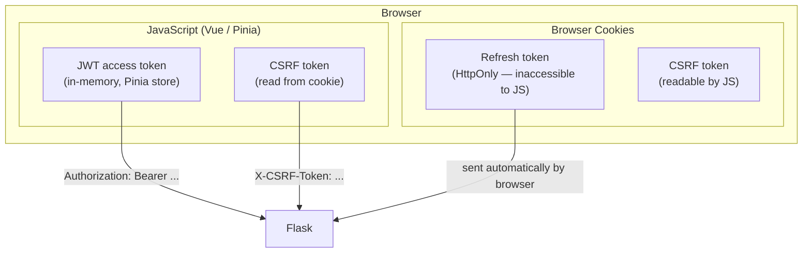
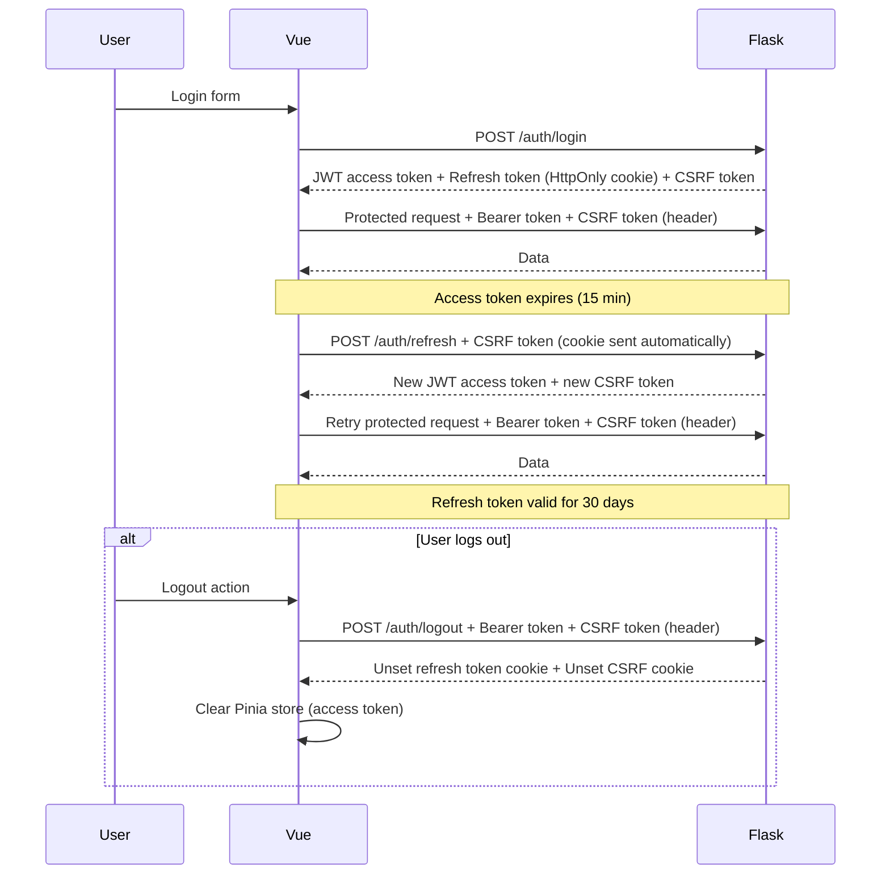
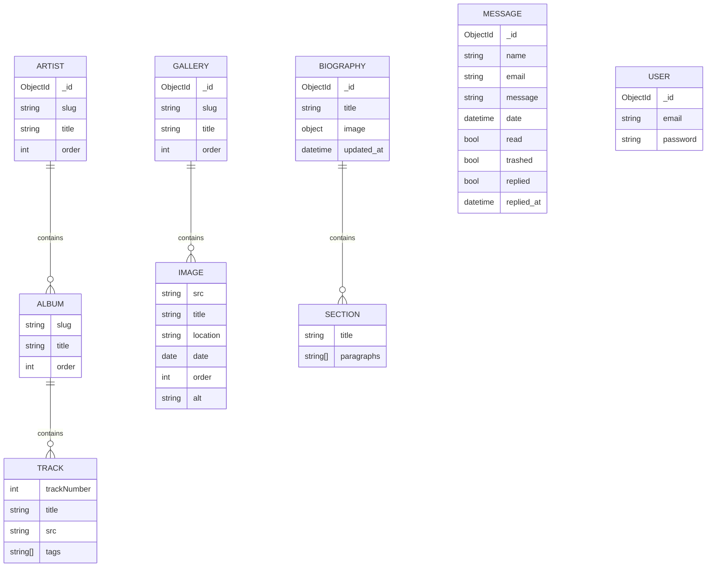

# Artist Portfolio — Block 3: Frameworks

> [!NOTE]
> Part of a 3-block final project series.
> - [Block 1 — Frontend](https://github.com/hakamir/Portfolio-Block-1) (vanilla HTML/CSS/JS)
> - [Block 2 — Backend](https://github.com/hakamir/Portfolio-Block-2) (raw Python)
> - **[Block 3 — Full-stack with frameworks](https://github.com/hakamir/Portfolio-Block-3) (this repo)**

A full-stack portfolio web application for a music artist. Built with **Vue 3** on the frontend and **Flask** on the
backend, with **MongoDB** as the database.

---

## Summary

1. [Features](#features)
2. [Tech Stack](#tech-stack)
3. [Architecture](#architecture)
4. [Getting Started](#getting-started)
5. [Database](#database)
6. [Testing](#testing)
7. [API Endpoints](#api-endpoints)
8. [API Endpoints (detailed)](#api-endpoints-detailed)

---

## Features

<sub>[← Back to summary](#summary)</sub>

### Public

- **Home** — Hero section and biography
- **Portfolio** — Browse artists, albums, and tracks with an integrated audio player; full-text search
- **Gallery** — Multi-gallery image viewer with progressive loading
- **Contact** — Rate-limited contact form

### Admin Dashboard (protected)

- **Works** — Full CRUD for artists → albums → tracks; drag-and-drop reordering; audio file upload
- **Gallery** — Full CRUD for galleries and images; image upload (WebP)
- **Biography** — Content editor
- **Messages** — Inbox with read/unread status, trash and bulk actions
- **Settings** — Change password; orphaned gallery and audio cleanup; orphaned audio rollback from ID3 metadata; change
  background images

---

## Tech Stack

| Layer                  | Technology                                          |
|------------------------|-----------------------------------------------------|
| **Frontend framework** | Vue 3 · Composition API · `<script setup>`          |
| **Build tool**         | Vite 8                                              |
| **Language**           | TypeScript                                          |
| **State management**   | Pinia                                               |
| **Routing**            | Vue Router 4                                        |
| **Styling**            | Tailwind CSS 4.2                                    |
| **HTTP client**        | Axios (JWT interceptors)                            |
| **Backend framework**  | Flask                                               |
| **Database**           | MongoDB (MongoEngine ODM)                           |
| **Authentication**     | Flask-JWT-Extended (15 min access / 30 day refresh) |
| **Password hashing**   | bcrypt                                              |
| **Rate limiting**      | Flask-Limiter                                       |
| **Containerisation**   | Docker · Docker Compose · Nginx                     |

---

## Architecture

<sub>[← Back to summary](#summary)</sub>

### Overview

The application follows a classic three-tier architecture. The browser loads the Vue 3 Single Page Application (SPA),
which communicates exclusively with the Flask API via Axios. Flask handles all business logic and dispatches to either
MongoDB (structured data) or the uploads folder (image/audio files).

```mermaid
flowchart TB
    classDef blue fill: #024, stroke: #06a
    classDef yellow fill: #330, stroke: #aa0
    classDef green fill: #030, stroke: #0a0

    subgraph Frontend["Frontend — Vue 3 SPA (Vite, TypeScript)"]
        Router[Vue Router]:::yellow
        Pinia[Pinia Store]:::yellow
        Axios[Axios + JWT Interceptors]:::yellow
    end

    subgraph Backend["Backend — Flask API"]
        Auth[Auth Controller]:::green
        Artists[Artists Controller]:::green
        Gallery[Gallery Controller]:::green
        Bio[Biography Controller]:::green
        Messages[Messages Controller]:::green
        Uploads[Uploads Controller]:::green
        Orphans[Orphans Controller]:::green
    end

    subgraph Data["Data Layer"]
        Mongo[(MongoDB)]:::blue
        FS[(Uploads Folder)]:::blue
    end

    Router --> Pinia
    Pinia --> Axios
    Axios -->|HTTP/JSON| Auth & Artists & Gallery & Bio & Messages & Uploads & Orphans
    Auth & Artists & Gallery & Bio & Messages --> Mongo
    Uploads & Orphans --> FS
```



---

### Authentication flow

Three tokens are involved in the authentication system, each stored differently based on its security requirements. The
access token lives in-memory (Pinia) to avoid XSS exposure. The refresh token is stored in an HttpOnly cookie, making it
inaccessible to JavaScript. The CSRF token is stored in a readable cookie so that Vue can extract it and send it as a
request header, following the double-submit cookie pattern.



The sequence below shows the full lifecycle: initial login, a protected request, the automatic token refresh when the
access token expires (15 min), and the logout flow which clears all three tokens.



---

### Data model

MongoDB stores five collections. Three of them use nested documents: `artists` embeds albums and tracks, `galleries`
embeds images, and `biography` embeds sections. `messages` and `users` are flat collections.



---

### File upload & orphan lifecycle

Binary files (audio, images) and their metadata are stored independently — the file in the uploads folder, the metadata
in MongoDB. This means deleting an artist or gallery via the API removes the metadata but leaves the file on disk. These
files are called orphans. A dedicated endpoint pair (`GET` + `DELETE /orphans/*`) allows the admin to inspect and clean
them up from the dashboard.

```mermaid
flowchart LR
    classDef cyan fill: #033, stroke: #0aa 
    classDef blue fill: #024, stroke: #06a
    Upload["POST /upload/audio\nor /upload/gallery"]:::cyan
    Meta["PUT /artists\nor PUT /gallery"]:::cyan
    DeleteDoc["DELETE /artists/:id\nor /gallery/:id"]:::cyan
    FS[(Uploads Folder)]:::blue
    DB[(MongoDB)]:::blue
    Upload -->|saves file| FS
    Meta -->|saves metadata| DB
    FS & DB -->|both present| Published[Visible in Portfolio]
    DeleteDoc -->|removes metadata| DB
    DB -.->|file remains| Orphan[Orphaned file in /uploads]
    Orphan -->|GET /orphans/audio\nor /orphans/gallery| List[List orphans]
    List -->|DELETE /orphans/audio\nor /orphans/gallery| Cleaned[File deleted from /uploads]
    List -->|GET /upload/filepath?download = true| Download[Download file]
```



---

### Rate limiting

Three endpoints are rate-limited to mitigate brute-force and spam risks: the login route (5 req/min), the password
change route (1 req/min), and the public contact form (1 req/min). Limits are tracked per IP by Flask-Limiter, which
persists its counters in MongoDB (`counter` and `windows` collections).

```mermaid
flowchart LR
    classDef cyan fill: #033, stroke: #0aa 
    classDef yellow fill: #330, stroke: #aa0
    classDef red fill: #300, stroke: #a00
    classDef green fill: #030, stroke: #0a0
    Login["POST /auth/login"]:::cyan
    Password["PUT /auth/password"]:::cyan
    Contact["POST /messages"]:::cyan
    L1["5 req/min"]:::yellow
    L2["1 req/min"]:::yellow
    L3["1 req/min"]:::yellow
    Limiter["Flask-Limiter\nMongoDB (counter + windows)"]:::green
    Block["429 Too Many Requests"]:::red
    Login --- L1 --> Limiter
    Password --- L2 --> Limiter
    Contact --- L3 --> Limiter
    Limiter --> Block
```



---

### Docker services

**Development** runs four services. The frontend is exposed on `:80`, the Flask API on `:5000`, and MongoDB is
accessible from the host on `:27018` (e.g., via Compass). A `seeder` service runs once on first startup to create the
admin user and default biography document.

**Production** exposes only two ports through Nginx: `:80` returns a 301 redirect to HTTPS, and `:443` handles SSL
termination (TLSv1.2/1.3, Let's Encrypt) and applies security headers (HSTS, CSP, X-Frame-Options). Traffic is then
routed internally — `/api/*` is proxied to Flask via `http://backend:5000`, `/` serves the built Vue SPA, and static
assets are cached for 1 year. The backend (`http://backend:5000`) and MongoDB (`mongodb:27017`) are reachable only
within the Docker network.

```mermaid
flowchart TB
    classDef cyan fill: #033, stroke: #0aa
    classDef yellow fill: #330, stroke: #aa0
    classDef orange fill: #530, stroke: #a70
    classDef green fill: #030, stroke: #0a0
    classDef blue fill: #024, stroke: #06a

    subgraph dev["Development"]
        Browser_dev[Browser]
        subgraph compose_dev["docker-compose.yml + docker-compose.override.yml"]
            Frontend_dev["frontend:80\nVue app (Vite dev server)"]:::yellow
            Backend_dev["backend:5000\nFlask API"]:::green
            MongoDB_dev[("mongodb:27018\nMongoDB")]:::blue
            Seeder_dev["seeder\nCreates admin user\n+ default biography"]:::orange
        end
        FS_dev[(Uploads Folder)]:::blue
        Browser_dev --> Frontend_dev
        Frontend_dev <-->|Axios| Backend_dev
        Backend_dev <--> MongoDB_dev
        Seeder_dev -->|on first run| MongoDB_dev
        Backend_dev <-->|serves files| FS_dev
    end

    subgraph prod["Production"]
        Browser_prod[Browser]

        subgraph compose_prod["docker-compose.yml + docker-compose.prod.yml"]
            subgraph nginx_box["Nginx"]
                N1[":80 → 301 redirect to HTTPS"]
                N2[":443 SSL — TLSv1.2/1.3\nHSTS · X-Frame-Options\nCSP · X-Content-Type-Options"]
                N3["location /api/ → proxy_pass backend:5000\nlocation / → try_files (SPA)\nlocation *.js|css|webp… → cache 1y"]
            end
            Frontend_prod["frontend\nVue app (built)\n/usr/share/nginx/html"]:::yellow
            Backend_prod["backend\nFlask API\n(internal — http://backend:5000)"]:::green
            MongoDB_prod[("MongoDB\n(internal — mongodb:27017)")]:::blue
            Seeder_prod["seeder\nCreates admin user\n+ default biography"]:::orange
        end
        FS_prod[(Uploads Folder)]:::blue
        Browser_prod -->|HTTP :80| N1
        N1 -->|301 https://deviance . studio| Browser_prod
        Browser_prod -->|HTTPS :443| N2
        N2 --> N3
        N3 -->|" static files (SPA) "| Frontend_prod
        N3 -->|" /api/* "| Backend_prod
        Backend_prod <--> MongoDB_prod
        Seeder_prod -->|on first run| MongoDB_prod
        Backend_prod <-->|serves files| FS_prod
    end
    dev ~~~ prod
```



---

### CI/CD

Two pipelines run on GitHub Actions. **CI** triggers on every push to `framework` and runs in parallel: the backend test
suite (pytest) and a frontend build check. **CD** triggers on every push to `main`, builds and publishes Docker images
to GHCR, then deploys to the VPS over SSH.

A ruleset protects `main` from direct pushes. Changes must go through `framework` first, then reach `main` via a pull
request, which triggers the CD pipeline.

```mermaid
flowchart TB
    classDef yellow fill: #330, stroke: #aa0
    classDef green fill: #030, stroke: #0a0
    classDef cyan fill: #033, stroke: #0aa
    classDef blue fill: #024, stroke: #06a
    classDef orange fill: #530, stroke: #a70
    classDef gray fill: #222, stroke: #666
    Dev["Developer"]:::gray
    Framework["branch: framework"]:::gray
    PR["Pull Request"]:::gray
    Main["branch: main\n(protected — no direct push)"]:::gray
    Dev -->|push| Framework
    Framework -->|triggers| ci
    Framework -->|CI passes| PR
    PR -->|merge| Main
    Main -->|triggers| cd

    subgraph ci["CI — push to 'framework'"]
        direction TB
        subgraph test["Backend API tests"]
            direction LR
            T1["Checkout"]:::cyan
            T2["Python 3.14"]:::cyan
            T3["pip install requirements\n+ requirements-test"]:::cyan
            T4["pytest"]:::cyan
            T1 --> T2 --> T3 --> T4
        end
        subgraph build["Frontend build check"]
            direction LR
            F1["Checkout"]:::yellow
            F2["Node.js 22"]:::yellow
            F3["npm ci"]:::yellow
            F4["npm run build"]:::yellow
            F1 --> F2 --> F3 --> F4
        end
        test --> build
        test ~~~ build
    end

    subgraph cd["CD — push to 'main'"]
        direction TB
        subgraph publish["Publish Docker images"]
            P1["Checkout"]:::green
            P2["Login to GHCR"]:::green
            P3["Build & push\nbackend:latest"]:::green
            P4["Build & push\nfrontend:latest\n(VITE_API_URL secret)"]:::green
            P1 --> P2 --> P3 & P4
        end
        subgraph deploy["Deploy on VPS"]
            D1["Checkout"]:::orange
            D2["SCP → copy\ndocker-compose.yml\ndocker-compose.prod.yml\nnginx.prod.conf"]:::orange
            D3["SSH → docker compose pull\n+ up -d\n+ image prune"]:::orange
            D1 --> D2 --> D3
        end
        GHCR[("GHCR\nghcr.io/owner/\nbackend:latest\nfrontend:latest")]:::blue
        publish --> deploy
    end

    VPS["VPS"]:::blue
    P3 & P4 --> GHCR
    GHCR -->|pull| D3
    D3 --> VPS
```



---

## Getting Started

<sub>[← Back to summary](#summary)</sub>

### Docker

**1. Configure environment**

```bash
cp .env.example .env
```

Fill in `.env`:

```env
MONGO_ROOT_USER=root
MONGO_ROOT_PASSWORD=your_root_password
MONGODB_USER=portfolio
MONGODB_PASSWORD=your_db_password
MONGODB_DATABASE=Portfolio

JWT_SECRET_KEY=your_long_random_secret
JWT_ACCESS_TOKEN_EXPIRES=15
JWT_REFRESH_TOKEN_EXPIRES=30

TEST_USER_EMAIL=admin@example.com
TEST_USER_PASSWORD=P@ssw0rdT3$st
```

**2. Start all services**

```bash
docker compose up --build
```

This runs four services:

|  Service   | URL                   | Description                        |
|:----------:|-----------------------|------------------------------------|
| `frontend` | http://localhost      | Vue app (Vite dev server)          |
| `backend`  | http://localhost:5000 | Flask API                          |
| `mongodb`  | localhost:27018       | MongoDB (host access)              |
|  `seeder`  | —                     | Creates test user + biography data |

On the first run, the seeder automatically creates:

- An admin user with the email/password from `.env`
- A default biography document

**3. Useful commands**

```bash
docker compose down          # stop (data preserved)
docker compose down -v       # stop + wipe database
docker compose logs backend  # view backend logs
docker compose cp backend/uploads/. backend:/app/uploads/  # restore local uploads
```

**Connect to MongoDB via Compass (dev only):**

```
mongodb://root:<MONGO_ROOT_PASSWORD>@localhost:27018/?authSource=admin
```

Or :

```
mongodb://<MONGODB_USER>:<MONGO_PASSWORD>@localhost:27018/?authSource=<MONGODB_DATABASE>
```

### Production

```bash
docker compose -f docker-compose.yml -f docker-compose-prod.yml up --build
```

Both `docker-compose.yml` and `docker-compose.prod.yml` should be specified for the production build.

> [!WARNING]
> The production build awaits an SSL certificate to work properly. It is not intended to be tested locally.

## Database

<sub>[← Back to summary](#summary)</sub>

MongoDB collections, created automatically on first Docker startup:

| Collection  | Description                                    |
|-------------|------------------------------------------------|
| `users`     | Admin account (email + bcrypt-hashed password) |
| `artists`   | Nested document: artist → album → tracks       |
| `galleries` | Nested document: gallery → images              |
| `biography` | Single document                                |
| `messages`  | Contact form submissions                       |

Flask Limiter creates two additional collections automatically: `counter` and `windows`, used to store rate-limits by IP
address and request.

---

## Testing

<sub>[← Back to summary](#summary)</sub>

### Philosophy

The backend is covered by an **integration test suite** (sometimes called API tests or functional tests). Each test
sends an HTTP request through the full Flask stack (router → controller → model → database) and asserts on the HTTP
response and the resulting database state.

This is distinct from *unit tests*, which would test a single function in complete isolation (mocking all
dependencies). For this project, integration tests offer better value: they catch bugs across the entire request
lifecycle, including validation logic, authentication guards, and database interactions, without requiring artificial
mocks of the application's own code.

### Infrastructure

| Tool                    | Role                                                   |
|-------------------------|--------------------------------------------------------|
| **pytest**              | Test runner and fixture system                         |
| **mongomock**           | In-memory MongoDB — no real database needed            |
| **Flask test client**   | Simulates HTTP requests without starting a real server |
| **unittest.mock.patch** | Mocks filesystem operations and external utilities     |

#### How the test database works

MongoEngine normally connects to a real MongoDB instance. In tests, this is intercepted using `unittest.mock.patch`
targeting the `init_db` function at the moment it is called by the app factory:

```python
def _init_db_mock(_settings):
    me_connect('testdb', mongo_client_class=mongomock.MongoClient)


with patch('app.init_db', _init_db_mock):
    flask_app = create_app(settings=TestSettings(), testing=True)
```

This replaces the real MongoDB connection with an in-memory mock, invisible to the rest of the application. No
changes were needed in production code to make this work.

#### Fixture design

Three fixtures are defined in `conftest.py` and shared across all test files:

- `app (session-scoped)` - one Flask app instance for the whole test session
- `client (function-scoped)` - a fresh test client per test (prevents cookie jar pollution between tests)
- `auth_headers` - a valid JWT Bearer token for authenticated routes
- `clean_db` (autouse) – drops all collections after each test, ensuring isolation

The `client` fixture is **function-scoped** deliberately. A session-scoped client would carry cookies (including the
`refresh_token` HttpOnly cookie set at login) across tests, causing false passes or false failures in tests that
expect an unauthenticated state.

### Running the tests

From the project root:

```bash
pytest -v
```

From the `backend/` directory:

```bash
pytest -v --rootdir=. tests/
```

Additional packages required for testing:

```bash
pip install -r .\backend\requirements-test.txt
```

### Coverage

All seven API controllers are covered. Tests are located in `backend/tests/integration/`.

| File                | Controller            | Tests                                                           |
|---------------------|-----------------------|-----------------------------------------------------------------|
| `test_auth.py`      | `routes/auth.py`      | Login, refresh (cookie jar), logout, change password            |
| `test_biography.py` | `routes/biography.py` | GET singleton, PUT with full structure                          |
| `test_artists.py`   | `routes/artists.py`   | GET, bulk upsert, delete, MongoEngine validation                |
| `test_gallery.py`   | `routes/gallery.py`   | GET, bulk upsert, slug/image consistency validation, delete     |
| `test_messages.py`  | `routes/messages.py`  | GET (JWT), create, update (read/replied/replied_at), delete     |
| `test_orphans.py`   | `routes/orphans.py`   | List and delete orphaned audio and gallery files                |
| `test_uploads.py`   | `routes/uploads.py`   | Audio upload with conversion, gallery upload, background upload |

### Notable test patterns

**Testing the refresh token flow**

The `/api/auth/refresh` endpoint reads the refresh token from an HttpOnly cookie, not from a header. Testing this
requires the cookie to be set naturally by the test client's cookie jar, the same way a browser would handle it:

```python
with app.test_client() as c:
    # Login first — the test client stores the refresh cookie automatically
    c.post("/api/auth/login", json={...})
    # The refresh request sends the cookie back, just like a browser would
    response = c.post("/api/auth/refresh")
    assert response.status_code == 200
```

Passing the cookie manually via a `Cookie` header does not work reliably with Werkzeug's test client.

**Mocking filesystem operations**

The upload and orphan routes interact with the real filesystem (`os.makedirs`, `os.remove`, `os.path.exists`).
In tests, these are patched to avoid any disk access:

```python
with patch('routes.uploads.os.makedirs'), patch('werkzeug.datastructures.FileStorage.save'):
    response = client.post("/api/upload/gallery", data={...})
```

External utilities that depend on system binaries (`AudioConverter.to_mp3` → ffmpeg,
`is_valid_webp` → Pillow) are similarly patched at the module level:

```python
with patch('routes.uploads.AudioConverter.to_mp3', return_value=MagicMock()):
    ...
```

**Testing MongoEngine-level validation**

Some validation happens not at the Pydantic schema level but inside MongoEngine's `clean()` method. For example,
`Artist.clean()` rejects an artist with zero albums — a constraint that Pydantic does not enforce. A dedicated test
verifies that this lower-level validation still surfaces as a `400` response:

```python
# Empty albums list passes Pydantic but fails Artist.clean()
response = client.put("/api/artists", json=[{**_VALID_ARTIST_PAYLOAD, "albums": []}], ...)
assert response.status_code == 400
```

---

## API Endpoints

<sub>[← Back to summary](#summary)</sub>

All routes are prefixed with `/api`.

### [Authentication](#authentication-1)

| Method | Path                                         | Auth | Description       |
|-------:|----------------------------------------------|------|-------------------|
|   POST | [`/api/auth/login`](#post-apiauthlogin)      | —    | Login (5 req/min) |
|   POST | [`/api/auth/logout`](#post-apiauthlogout)    | JWT  | Logout            |
|   POST | [`/api/auth/refresh`](#put-apiauthpassword)  | JWT  | Refresh token     |
|    PUT | [`/api/auth/password`](#post-apiauthrefresh) | JWT  | Change password   |

### [Artists](#artists-1)

| Method | Path                                        | Auth | Description                      |
|-------:|---------------------------------------------|------|----------------------------------|
|    GET | [`/api/artists`](#get-apiartists)           | —    | All artists with albums & tracks |
|    PUT | [`/api/artists`](#put-apiartists)           | JWT  | Create/update artists (bulk)     |
| DELETE | [`/api/artists/<id>`](#delete-apiartistsid) | JWT  | Delete artist                    |

### [Biography](#biography-1)

| Method | Path                                  | Auth | Description       |
|-------:|---------------------------------------|------|-------------------|
|    GET | [`/api/biography`](#get-apibiography) | —    | Biography content |
|    PUT | [`/api/biography`](#put-apibiography) | JWT  | Update biography  |

### [Gallery](#gallery-1)

| Method | Path                                        | Auth | Description                    |
|-------:|---------------------------------------------|------|--------------------------------|
|    GET | [`/api/gallery`](#get-apigallery)           | —    | All galleries with images      |
|    PUT | [`/api/gallery`](#put-apigallery)           | JWT  | Create/update galleries (bulk) |
| DELETE | [`/api/gallery/<id>`](#delete-apigalleryid) | JWT  | Delete gallery                 |

### [Messages](#messages-1)

| Method | Path                                          | Auth | Description                 |
|-------:|-----------------------------------------------|------|-----------------------------|
|    GET | [`/api/messages`](#get-apimessages)           | JWT  | List messages               |
|   POST | [`/api/messages`](#post-apimessages)          | —    | Submit message (1 req/min)  |
|  PATCH | [`/api/messages/<id>`](#patch-apimessagesid)  | JWT  | Update message (read/trash) |
| DELETE | [`/api/messages/<id>`](#delete-apimessagesid) | JWT  | Delete message              |

### [Uploads](#uploads-1)

| Method | Path                                                  | Auth | Description              |
|-------:|-------------------------------------------------------|------|--------------------------|
|    GET | [`/api/upload/<path>`](#get-apiupload)                | —    | Serve uploaded files     |
|   POST | [`/api/upload/audio`](#post-apiuploadaudio)           | JWT  | Upload audio files       |
|   POST | [`/api/upload/gallery`](#post-apiuploadgallery)       | JWT  | Upload gallery images    |
|   POST | [`/api/upload/background`](#post-apiuploadbackground) | JWT  | Upload background images |

### [Orphaned files management](#orphaned-files)

| Method | Path                                                           | Auth | Description                  |
|-------:|----------------------------------------------------------------|------|------------------------------|
|    GET | [`/api/orphans/audio`](#get-apiorphansaudio)                   | JWT  | List orphaned audio files    |
|   POST | [`/api/orphans/audio/rollback`](#post-apiorphansaudiorollback) | JWT  | Restore orphaned audio files |
| DELETE | [`/api/orphans/audio`](#delete-apiorphansaudio)                | JWT  | Delete orphaned audio files  |
|    GET | [`/api/orphans/gallery`](#get-apiorphansgallery)               | JWT  | List orphaned image files    |
| DELETE | [`/api/orphans/gallery`](#delete-apiorphansgallery)            | JWT  | Delete orphaned image files  |

---

## API Endpoints (detailed)

<sub>[← Back to summary](#summary)</sub>

### Authentication

<sub>[← Back to API endpoints](#api-endpoints)</sub>

## `POST /api/auth/login`

Rate-limited to **5 req/min** by default. No authentication required.

**Request body:**

```json
{
  "email": "admin@example.com",
  "pwd": "<Your Password>"
}
```

**Response `200`:**

```json
{
  "token": "<JWT access token>"
}
```

Also, a refresh token is set in an HttpOnly cookie on success.

**Errors:** `400` missing credentials - `401` invalid credentials

## `POST /api/auth/logout`

Unset JWT cookies from the client's browser, logging the user out.

**Request body:**

- None

**Response `200`:**

```json
{
  "logged_out": true
}
```

## `PUT /api/auth/password`

Rate-limited to **1 req/min** by default. Authentication required.

Rate limit is present to avoid brute-force attacks if JWT is compromised.

**Request body:**

```json
{
  "currentPwd": "Curr3n!_P@ssw0rd",
  "newPwd": "N3w!_P@ssw0rd12+3="
}
```

**Response `200`:**

```json
{
  "updated": true
}
```

**Errors:** `400` validation errors - `401` invalid credentials

## `POST /api/auth/refresh`

Creates a new access token using a valid refresh token.

**Request body:**

- None

**Response `200`:**

```json
{
  "token": "<new JWT access token>"
}
```

**Errors:** `401` No refresh token found / expired - `422` Malformed/Wrong refresh token / invalid signature

---

### Artists

<sub>[← Back to API endpoints](#api-endpoints)</sub>

## `GET /api/artists`

Returns all artists with albums and tracks. No authentication required.

**Response `200`:**

```json
[
  {
    "_id": {
      "$oid": "69d7994ec52a15fb197c2908"
    },
    "slug": "artist_1",
    "title": "Artist 1",
    "order": 1,
    "albums": [
      {
        "slug": "album_1",
        "title": "Album 1",
        "order": 1,
        "tracks": [
          {
            "trackNumber": 1,
            "title": "Track 1",
            "src": "track_1.mp3",
            "tags": [
              "tag1",
              "tag2",
              "tag4"
            ]
          },
          {
            "trackNumber": 2,
            "title": "Track 2",
            "src": "track_2.mp3",
            "tags": [
              "tag1",
              "tag3"
            ]
          }
        ]
      },
      {
        "slug": "album_2",
        "title": "Album 2",
        "order": 2,
        "tracks": [
          {
            "trackNumber": 1,
            "title": "Track 1",
            "src": "track_1.mp3",
            "tags": [
              "tag1",
              "tag4"
            ]
          },
          {
            "trackNumber": 2,
            "title": "Track 2",
            "src": "track_2.mp3",
            "tags": [
              "tag1",
              "tag3"
            ]
          },
          {
            "trackNumber": 3,
            "title": "Track 3",
            "src": "track_3.mp3",
            "tags": [
              "tag4"
            ]
          }
        ]
      }
    ]
  }
]
```

## `PUT /api/artists`

Applicative bulk upsert: Processes a list of artists. Each entry is validated, then either updated (if an ID is
provided) or
created, including nested albums and tracks. JWT required.
New artists have an empty `_id` field. Existing artists update their corresponding documents by ID. Raise `404` if given
`id` does not exist.

**Request body:** Follow the structure of the `GET /api/artists` response.

**Response `200`:**

```json
{
  "updated": true
}
```

**Error** `400`: List expected/Validation error- `401` Unauthorized - `404` Artist not found - `415`: Invalid
content-type (JSON expected)

## `DELETE /api/artists/<id>`

Removes an artist and all associated albums and tracks by `id`. JWT required.

**Response `200`:**

```json
{
  "deleted": true
}
```

**Error** `400`: Invalid ID - `401` Unauthorized - `404` Artist not found

This method does not delete the actual audios from the `uploads/audio/` folder. After artist removal, all associated
albums and tracks become [orphans](#get-apiorphansaudio).

---

### Biography

<sub>[← Back to API endpoints](#api-endpoints)</sub>

## `GET /api/biography`

Returns the biography structure, including the main title, associated image URL, and sections with paragraphs.
The biography is stored as a singleton document. No authentication required.

**Response `200`:**

```json
{
  "biography": {
    "_id": "3e5f65c9500d4440b1ad7c4c3103bf19",
    "title": "Biography",
    "image": {
      "sm": "/biography/biography-1-512.webp",
      "md": "/biography/biography-1-1024.webp",
      "lg": "/biography/biography-1-2048.webp"
    },
    "updated_at": "2026-05-19 14:35:17",
    "sections": [
      {
        "title": "Section Title",
        "paragraphs": [
          "Example paragraph"
        ]
      }
    ]
  }
}
```

**Error** `404`: No biography entry found, caused when the seeder was not run.

## `PUT /api/biography`

Updates the biography. The whole structure is required. JWT required.

**Request body:**

```json
{
  "biography": {
    "_id": "b3f435dc399b11f1a3ca244bfe4c7954",
    "title": "Who am I?",
    "image": {
      "sm": "/biography/biography-1-512.webp",
      "md": "/biography/biography-1-1024.webp",
      "lg": "/biography/biography-1-2048.webp"
    },
    "updated_at": "2026-05-19 14:49:19",
    "sections": [
      {
        "title": "Background & Musical Foundation",
        "paragraphs": [
          "I am a professional guitarist and composer...",
          "Formally trained in contemporary music and jazz..."
        ]
      }
    ]
  }
}
```

**Response `200`:** Updated biography object (same shape as GET).

**Errors:** `400` malformed body - `401` missing/invalid token

---

### Gallery

<sub>[← Back to API endpoints](#api-endpoints)</sub>

## `GET /api/gallery`

Returns all galleries with associated image metadata and URL. No authentication required.

**Response `200`:**

```json
[
  {
    "_id": {
      "$oid": "69db8e78a650f456163ba186"
    },
    "images": [
      {
        "src": "gallery_1_a296a2f6-5ff9-4e49-bd5a-23d16b34b863.webp",
        "title": "Image 1 title",
        "location": "Somewhere",
        "date": {
          "$date": "2025-11-14T00:00:00.000Z"
        },
        "order": 1,
        "alt": "Image 1 title, Somewhere, 2025"
      },
      {
        "src": "gallery_1_a296a2f6-5ff9-4e49-bd5a-23d16b34b863.webp",
        "title": "Image 2 title",
        "location": "Somewhere else",
        "date": {
          "$date": "2024-04-29T00:00:00.000Z"
        },
        "order": 2,
        "alt": "Image 2 title, Somewhere else, 2024"
      }
    ],
    "order": 1,
    "slug": "gallery_1",
    "title": "Gallery 1"
  }
]
```

## `PUT /api/gallery`

Applicative bulk upsert: Processes a list of galleries. Each entry is validated, then either updated (if an ID is
provided) or
created, including nested images. JWT required.
New galleries have an empty `_id` field. Existing galleries update their corresponding documents by ID. Raise `404` if
given
`id` does not exist.

**Request body:** Follow the structure of the `GET /api/gallery` response.

**Response `200`:**

```json
{
  "updated": true
}
```

**Error** `400`: List expected/Validation error- `401` Unauthorized - `404` Gallery not found - `415`: Invalid
content-type (JSON expected)

## `DELETE /api/gallery/<id>`

Removes a gallery and images meta by `id`. JWT required.

This method does not delete the actual images from the `uploads/gallery/` folder. After gallery removal, all associated
images become [orphans](#get-apiorphansgallery).

**Response `200`:**

```json
{
  "deleted": true
}
```

**Error** `400`: Invalid ID - `401` Unauthorized - `404` Gallery not found

---

### Messages

<sub>[← Back to API endpoints](#api-endpoints)</sub>

## `GET /api/messages`

Returns a list of all messages. JWT Required.

**Response `200`:**

```json
[
  {
    "name": "Jake Thompson",
    "email": "jake.thompson@gmail.com",
    "message": "Hi, I discovered your portfolio...",
    "date": "2026-04-07 22:45:34",
    "read": true,
    "trashed": true,
    "_id": "1"
  },
  {
    "name": "Emily Carter",
    "email": "emily.carter@musiclive.com",
    "message": "Hello, I'm organizing a live...",
    "date": "2026-01-16 18:32:45",
    "read": false,
    "trashed": false,
    "_id": "2"
  }
]
```

Respond with an empty array if no messages are found.

## `POST /api/messages`

Create a new message. Rate-limited to **1 req/min** by default. No authentication required.

**Request body:**

```json
{
  "name": "Test",
  "email": "test@test.com",
  "message": "test"
}
```

**Response `201`:**

```json
{
  "message": "Message created successfully"
}
```

**Errors:** `400` missing fields - `429` rate limit exceeded

Missing fields response example:

```json
{
  "error": "Missing required fields: email, message"
}
```

Look to [`GET /api/messages`](#get-apimessages) response to see the final data structure after the controller job.

## `PATCH /api/messages/<id>`

Marks a message as read, trashed, or replied. JWT required.

**Request body** (one or multiple fields):

```json
{
  "is_read": true,
  "is_trashed": false,
  "is_replied": false
}
```

**Response `200`:** Updated message object.

**Errors:** `400` malformed body · `401` unauthorized · `404` not found

## `DELETE /api/messages/<id>`

Permanently deletes a message. JWT required.

**Response `200`:**

```json
{
  "message": "Message deleted successfully"
}
```

**Errors:** `400` Invalid fields / type error / invalid request body - `401` unauthorized - `404` not found

---

### Uploads

<sub>[← Back to API endpoints](#api-endpoints)</sub>

## `GET /api/upload/*`

Serves files from the `uploads/` directory (backgrounds, audio, and gallery). No authentication required.

Example: `GET /api/upload/background/hero/hero-512.wepb`

Can also be used to download files from the server with the `download` query parameter set to `true`, setting the
response
header `Content-Disposition: attachment`.

Examples: `GET /api/upload/audio/artist/album/track.mp3?download=true`

## `POST /api/upload/audio`

Uploads an audio file. JWT required. Non-MP3 files are automatically converted to MP3 (192kbps, 44100 Hz stereo) via
ffmpeg before saving. ID3 tags (artist, album, title, track number) are written to the file after conversion, enabling
orphan rollback.

```formdata
file: <file> [Content-Disposition: form-data; name="file"; filename="<filename>.ext" Content-Type: audio/*]
artistSlug: artist_slug
albumSlug: album_slug
trackSrc: track_slug.mp3
artistTitle: Artist Title
albumTitle: Album Title
trackTitle: Track Title
trackNumber: 1
```

**Response `201`:**

```json
{
  "uploaded": true
}
```

**Errors:** `400` No file part/missing required field - `415` Invalid mime type/Invalid file type - `500` Conversion
failed

## `POST /api/upload/gallery`

Uploads gallery images. JWT required.

```formdata
file: <file> Content-Disposition: form-data; name="file"; filename="<filename>.ext" Content-Type: image/*
gallerySlug: gallery_slug
imageSrc: gallery_gallery_1_a296a2f6-5ff9-4e49-bd5a-23d16b34b863.webp
```

**Response `201`:**

```json
{
  "uploaded": true
}
```

**Errors:** `400` No file part/missing required field - `415` Invalid mime type/Invalid file type

## `POST /api/upload/background`

Uploads background images. JWT required.

```formdata
file: <file_2048> Content-Disposition: form-data; name="file"; filename="<filename>.ext" Content-Type: image/*
file: <file_1024> Content-Disposition: form-data; name="file"; filename="<filename>.ext" Content-Type: image/*
file: <file_512> Content-Disposition: form-data; name="file"; filename="<filename>.ext" Content-Type: image/*
destination: <destination> (hero | portfolio | biography)
```

**Response `201`:**

```json
{
  "uploaded": true
}
```

**Errors:** `400` Invalid destination/missing required field/Invalid file

---

### Orphaned files

<sub>[← Back to API endpoints](#api-endpoints)</sub>

## `GET /api/orphans/audio`

Returns a list of audio files present on the server but not linked to any artist in the database. Each entry includes
the relative file path and ID3 metadata if available. JWT required.

**Response `200`:**

```json
[
  {
    "file": "artist_slug/album_slug/track.mp3",
    "metadata": {
      "artist": "Artist Title",
      "album": "Album Title",
      "title": "Track Title",
      "track_number": 1
    }
  },
  {
    "file": "artist_slug/album_slug/track_no_tags.mp3",
    "metadata": null
  }
]
```

`metadata` is `null` if the file has no ID3 tags (e.g., uploaded before ID3 support was introduced). Files with `null`
metadata cannot be restored via the rollback endpoint and must be re-uploaded.

## `POST /api/orphans/audio/rollback`

Restores orphaned audio files to the database by reading their ID3 tags and upserting the corresponding artist → album →
track structure into MongoDB. JWT required.

Only files with valid ID3 metadata can be restored. If the artist or album does not exist, they are created with
`order: 1` and the slug derived from the file path. If the track already exists in the database, it is skipped.

**Request body:**

```json
{
  "files": [
    "artist_slug/album_slug/track.mp3",
    "artist_slug/album_slug/track2.mp3"
  ]
}
```

**Response `200`:**

```json
{
  "restored": [
    "artist_slug/album_slug/track.mp3"
  ],
  "failed": [
    {
      "file": "artist_slug/album_slug/track2.mp3",
      "error": "No ID3 metadata found"
    }
  ]
}
```

`restored` contains paths successfully upserted into the database.`failed` contains paths that could not be restored,
with an `error`field describing the reason. A `200` is returned even if some files failed — inspect `failed` to identify
partial failures.

**Errors:** `400` missing or invalid request body - `401` unauthorized

## `DELETE /api/orphans/audio`

Deletes selected orphaned audio files. JWT required.

**Request body**:

```json
{
  "files": [
    "artist/album/track1.mp3",
    "artist/album/track2.mp3",
    "artist/album/track3.mp3"
  ]
}
```

**Response `200`:**

```json
{
  "deleted": true
}
```

**Errors:** `401` unauthorized

## `GET /api/orphans/gallery`

Returns a list of image files that are not associated with any gallery. JWT required.

## `DELETE /api/orphans/gallery`

Deletes all orphaned image files. JWT required.

```json
{
  "files": [
    "gallery/gallery_0001.webp",
    "gallery/gallery_0002.webp",
    "gallery/gallery_0003.webp"
  ]
}
```

**Response `200`:**

```json
{
  "deleted": true
}
```

**Errors:** `401` unauthorized
